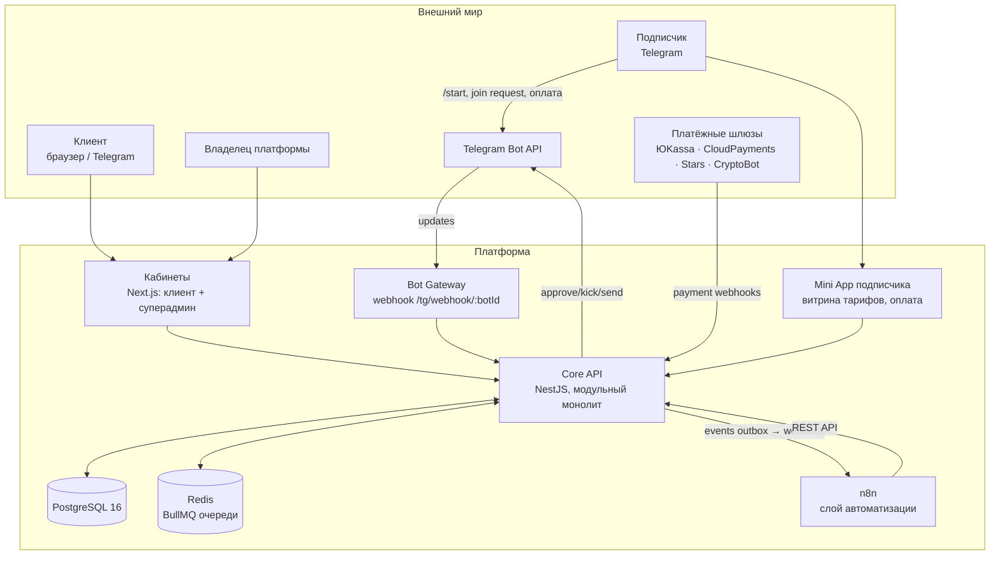
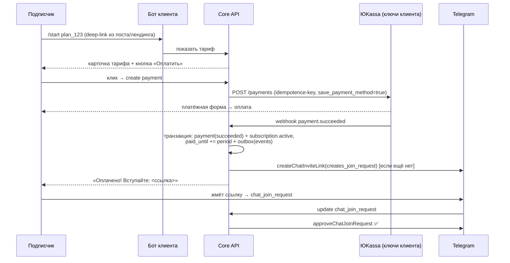
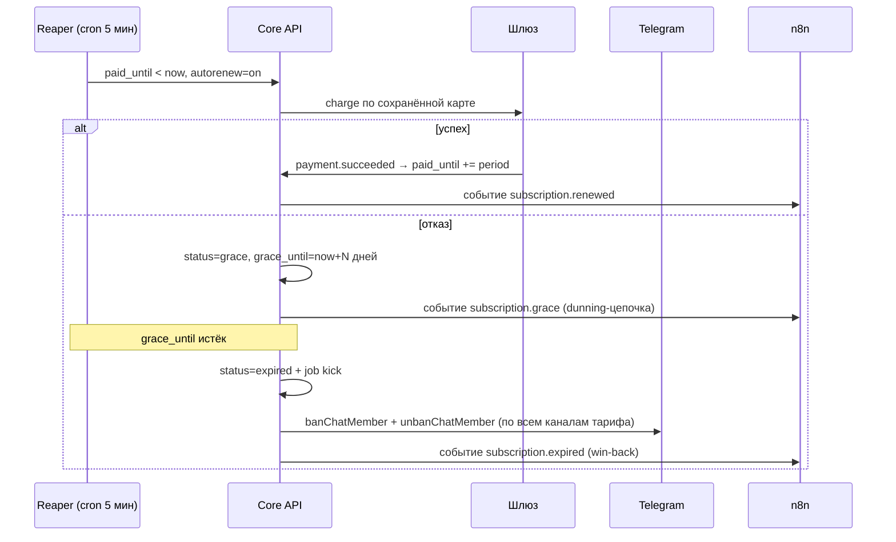

# 02 — Архитектура системы

## 1. Обзор (C4: контекст)

## 2. Компоненты

### 2.1 Core API (модульный монолит, NestJS + TypeScript)

Один деплой, внутри — модули с жёсткими границами (общение только через интерфейсы/события — это даёт лёгкий распил на сервисы позже, если понадобится):

| Модуль | Ответственность |
|---|---|
| `auth` | Регистрация/логин клиентов (e-mail + пароль, вход через Telegram Login Widget), JWT + refresh, роли (owner, client, client_staff) |
| `tenants` | Клиенты (тенанты), их платформенная подписка, enforcement лимитов |
| `platform-billing` | Платформенные тарифы (ваши), биллинг клиентов, счёт/оплата абонплаты |
| `bots` | Подключение ботов, шифрование токенов, установка webhook, health-check |
| `channels` | Каналы/чаты клиента, права бота, invite-ссылки |
| `plans` | Клиентские тарифы, промокоды, trial, связка тариф ↔ каналы |
| `subscriptions` | Статусная машина подписки, продления, grace, ручные операции |
| `payments` | Абстракция `PaymentProvider`, вебхуки шлюзов, идемпотентность, возвраты |
| `access` | Выдача/отзыв доступа: approve/decline join requests, kick, reconciliation |
| `messaging` | Исходящие сообщения ботов (очередь, rate limit по боту/чату), шаблоны |
| `events` | Outbox → доменные события наружу (в т. ч. в n8n), audit log |
| `analytics` | Метрики клиента (MRR, churn, активные) и платформы |

### 2.2 Bot Gateway

- Библиотека **grammY** (мульти-бот из коробки, TS).
- Endpoint `/tg/webhook/:botId`, проверка `X-Telegram-Bot-Api-Secret-Token`.
- Обрабатываемые updates: `message` (команды, /start deep-link `?start=plan_<id>`), `callback_query` (кнопки), `chat_join_request`, `chat_member`, `my_chat_member` (бота добавили/удалили из канала), `pre_checkout_query` + `successful_payment` (Stars/TG Payments).
- Никакой бизнес-логики: парсинг update → команда в соответствующий модуль ядра.

### 2.3 Фронтенды

| Приложение | Аудитория | Функции |
|---|---|---|
| **Кабинет клиента** (Next.js) | Клиенты | Онбординг-мастер (бот → канал → тариф → платежи), подписчики (поиск, ручная выдача/продление/бан), тарифы и промокоды, статистика, настройки уведомлений/dunning |
| **Суперадминка** (та же Next.js, роль owner) | Вы | Платформенные тарифы (CRUD, лимиты, фичи), клиенты и их статусы, биллинг, глобальная статистика, импersonation клиента для поддержки |
| **Mini App подписчика** (Telegram WebApp) | Подписчики | Витрина тарифов клиента, оплата, «мои подписки», продление. Открывается из бота кнопкой; авторизация — `initData` (подпись Telegram, пароль не нужен) |

Для MVP Mini App можно заменить чисто чат-ботом (кнопки + invoice), Mini App добавить в v1.

### 2.4 Очереди (Redis + BullMQ)

| Очередь | Задачи |
|---|---|
| `tg-outbound:<botId>` | Отправка сообщений с rate-limit на бота (30/с) и чат (1/с) |
| `access` | approve/decline/kick с retry + exponential backoff |
| `subscription-reaper` | Каждые 5 мин: active→grace, grace→expired (+ события) |
| `dunning` | Постановка напоминаний T-3, T-1, T-0, T+1, T+3 (даты — от `paid_until`) |
| `reconciliation` | Ночная сверка участников каналов со списком активных подписок |
| `billing` | Платформенный биллинг клиентов: инвойсы, suspend при неоплате |

### 2.5 Слой n8n

Подключается через два канала: **входящий** (ядро постит доменные события в n8n-webhook из outbox) и **исходящий** (n8n дёргает REST API ядра сервисным токеном). Подробно — [04-n8n-automation.md](./04-n8n-automation.md).

## 3. Ключевые потоки

### 3.1 Покупка подписки (внешний шлюз, ЮKassa)

### 3.2 Автосписание и отзыв доступа

### 3.3 Онбординг клиента

1. Регистрация (e-mail или Telegram Login) → создаётся tenant с планом `free`/`trial`.
2. Мастер: «подключите бота» (токен → `getMe` → шифрование → `setWebhook`) или «используйте бота платформы».
3. «Добавьте бота админом в ваш канал» → ждём `my_chat_member` → проверяем права → канал привязан.
4. Создание тарифа (цена/период/каналы) → подключение платежей (ключи ЮKassa / включение Stars).
5. Платформа генерирует invite-ссылку и deep-link `t.me/<bot>?start=plan_<id>` — клиент вставляет их в свои посты.

## 4. Технологический стек

| Слой | Выбор | Обоснование |
|---|---|---|
| Backend | **NestJS (Node 22, TypeScript)** | Модульность из коробки, DI, guards для tenant-scoping; единый язык с фронтом |
| Telegram | **grammY** | Лучшая TS-библиотека, мульти-бот, middleware, тесты |
| БД | **PostgreSQL 16** | Уже есть у вас; транзакции, JSONB для настраиваемых лимитов, RLS |
| ORM/миграции | Drizzle ORM (или Prisma) | Типобезопасность, явные SQL-миграции |
| Очереди/кеш | **Redis 7 + BullMQ** | Retry/backoff, cron-джобы, rate-limit |
| Frontend | **Next.js 15 + shadcn/ui** | Кабинеты + Mini App на одном стеке |
| Автоматизация | **ваш self-hosted n8n** | Событийная периферия, см. док 04 |
| Деплой | Docker Compose (ваш сервер) + Nginx/Traefik + Let's Encrypt | Совпадает с текущей инфраструктурой (n8n уже в Docker) |
| Наблюдаемость | pino → Loki/Grafana (или хотя бы journald), Sentry, `/healthz` + Uptime Kuma | Ошибки платежей нельзя терять |
| Секреты | env + шифрование токенов ботов (libsodium sealed box, ключ в env хоста) | Токены и ключи шлюзов не лежат в БД открытыми |

## 5. Безопасность

- **Токены ботов и ключи шлюзов** — только зашифрованными (AEAD), маскирование в логах, доступ по модулю `bots`/`payments`.
- **Webhook'и Telegram** — `secret_token` per bot; **webhook'и шлюзов** — проверка подписи (ЮKassa — по IP + basic-auth эндпоинта, CloudPayments — HMAC).
- **Идемпотентность всего входящего**: unique-ключи на `provider_payment_id`, `update_id` per bot.
- **RBAC**: owner (вы) / client / client_staff; tenant-scoping guard на каждом запросе; RLS вторым рубежом.
- **PCI DSS не затрагиваем**: карты видит только шлюз; мы храним лишь `payment_method_id`.
- **Rate limiting** на публичные эндпоинты (Mini App, auth) — Redis token bucket.
- **Аудит**: `audit_log` всех ручных действий (кто выдал доступ, кто сменил тариф).
- Персональные данные подписчиков минимальны (tg_user_id, username, имя) — 152-ФЗ: политика + согласие в боте при /start.

## 6. Масштабирование (когда понадобится)

Ядро stateless → горизонтально за балансировщиком; очереди уже шардированы по боту; PostgreSQL: сначала индексы и партиционирование `payments`/`subscription_events` по месяцам, потом реплика чтения для аналитики. Прогноз: один средний VPS (4 vCPU/8 GB) держит сотни клиентов и ~100–200 тыс. подписчиков — узкое место всегда rate-limit Telegram, а не CPU.
