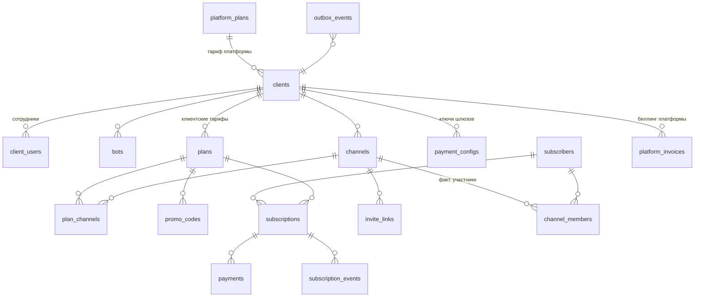

# 03 — Модель данных (PostgreSQL 16)

## 1. ERD (основные сущности)



## 2. SQL-схема (DDL, ядро)

```sql
-- ============ ПЛАТФОРМЕННЫЙ УРОВЕНЬ (вы) ============

CREATE TABLE platform_plans (              -- ваши настраиваемые тарифы
    id          uuid PRIMARY KEY DEFAULT gen_random_uuid(),
    code        text UNIQUE NOT NULL,      -- 'free' | 'start' | 'pro' | ...
    name        text NOT NULL,
    price_month numeric(12,2) NOT NULL DEFAULT 0,
    currency    text NOT NULL DEFAULT 'RUB',
    commission_pct numeric(5,2) NOT NULL DEFAULT 0,   -- инфо-комиссия для биллинга
    limits      jsonb NOT NULL DEFAULT '{}',
        -- {"bots":1,"channels":3,"subscribers":500,"staff":1}
    features    jsonb NOT NULL DEFAULT '{}',
        -- {"white_label":false,"custom_payments":false,"api":false}
    is_active   boolean NOT NULL DEFAULT true,
    sort_order  int NOT NULL DEFAULT 0,
    created_at  timestamptz NOT NULL DEFAULT now()
);

CREATE TABLE clients (                     -- тенанты
    id          uuid PRIMARY KEY DEFAULT gen_random_uuid(),
    name        text NOT NULL,
    platform_plan_id uuid NOT NULL REFERENCES platform_plans(id),
    plan_status text NOT NULL DEFAULT 'trialing',
        -- trialing | active | past_due | suspended | cancelled
    plan_paid_until timestamptz,
    settings    jsonb NOT NULL DEFAULT '{}',   -- grace_days, язык, брендинг…
    created_at  timestamptz NOT NULL DEFAULT now()
);

CREATE TABLE client_users (                -- логины в кабинет
    id          uuid PRIMARY KEY DEFAULT gen_random_uuid(),
    client_id   uuid REFERENCES clients(id),     -- NULL для владельца платформы
    role        text NOT NULL,             -- owner | client_admin | client_staff
    email       citext UNIQUE,
    password_hash text,
    tg_user_id  bigint UNIQUE,             -- вход через Telegram Login
    created_at  timestamptz NOT NULL DEFAULT now()
);

CREATE TABLE platform_invoices (           -- биллинг клиентов платформы
    id          uuid PRIMARY KEY DEFAULT gen_random_uuid(),
    client_id   uuid NOT NULL REFERENCES clients(id),
    period_start date NOT NULL,
    period_end   date NOT NULL,
    amount      numeric(12,2) NOT NULL,
    status      text NOT NULL DEFAULT 'pending', -- pending|paid|void|overdue
    details     jsonb NOT NULL DEFAULT '{}',
    created_at  timestamptz NOT NULL DEFAULT now()
);

-- ============ УРОВЕНЬ КЛИЕНТА ============

CREATE TABLE bots (
    id          uuid PRIMARY KEY DEFAULT gen_random_uuid(),
    client_id   uuid NOT NULL REFERENCES clients(id),
    tg_bot_id   bigint UNIQUE NOT NULL,
    username    text NOT NULL,
    token_enc   bytea NOT NULL,            -- зашифрованный токен
    webhook_secret text NOT NULL,
    is_platform_bot boolean NOT NULL DEFAULT false,
    status      text NOT NULL DEFAULT 'active',  -- active|token_invalid|disabled
    created_at  timestamptz NOT NULL DEFAULT now()
);

CREATE TABLE channels (
    id          uuid PRIMARY KEY DEFAULT gen_random_uuid(),
    client_id   uuid NOT NULL REFERENCES clients(id),
    bot_id      uuid NOT NULL REFERENCES bots(id),
    tg_chat_id  bigint NOT NULL,
    title       text NOT NULL,
    type        text NOT NULL DEFAULT 'channel',  -- channel|group
    bot_status  text NOT NULL DEFAULT 'ok',       -- ok|no_rights|removed
    kick_policy text NOT NULL DEFAULT 'kick',     -- kick|keep (что делать с истёкшими)
    created_at  timestamptz NOT NULL DEFAULT now(),
    UNIQUE (bot_id, tg_chat_id)
);

CREATE TABLE plans (                       -- тарифы клиента для подписчиков
    id          uuid PRIMARY KEY DEFAULT gen_random_uuid(),
    client_id   uuid NOT NULL REFERENCES clients(id),
    name        text NOT NULL,
    description text,
    price       numeric(12,2) NOT NULL,
    currency    text NOT NULL DEFAULT 'RUB',
    stars_price int,                       -- цена в Stars, если включено
    period_days int NOT NULL,              -- 7|30|90|365; 0 = lifetime
    trial_days  int NOT NULL DEFAULT 0,
    grace_days  int NOT NULL DEFAULT 3,
    autorenew   boolean NOT NULL DEFAULT true,
    is_active   boolean NOT NULL DEFAULT true,
    sort_order  int NOT NULL DEFAULT 0,
    created_at  timestamptz NOT NULL DEFAULT now()
);

CREATE TABLE plan_channels (               -- тариф открывает N каналов
    plan_id     uuid REFERENCES plans(id),
    channel_id  uuid REFERENCES channels(id),
    PRIMARY KEY (plan_id, channel_id)
);

CREATE TABLE promo_codes (
    id          uuid PRIMARY KEY DEFAULT gen_random_uuid(),
    client_id   uuid NOT NULL REFERENCES clients(id),
    plan_id     uuid REFERENCES plans(id), -- NULL = на все тарифы
    code        text NOT NULL,
    discount_pct numeric(5,2),
    bonus_days  int,
    max_uses    int,
    used_count  int NOT NULL DEFAULT 0,
    expires_at  timestamptz,
    UNIQUE (client_id, code)
);

CREATE TABLE payment_configs (             -- платёжные ключи клиента
    id          uuid PRIMARY KEY DEFAULT gen_random_uuid(),
    client_id   uuid NOT NULL REFERENCES clients(id),
    provider    text NOT NULL,             -- yookassa|cloudpayments|stars|cryptobot
    credentials_enc bytea,                 -- зашифрованные ключи (для stars NULL)
    is_active   boolean NOT NULL DEFAULT true,
    UNIQUE (client_id, provider)
);

-- ============ ПОДПИСЧИКИ И ПОДПИСКИ ============

CREATE TABLE subscribers (                 -- глобально по Telegram-аккаунту
    id          uuid PRIMARY KEY DEFAULT gen_random_uuid(),
    tg_user_id  bigint UNIQUE NOT NULL,
    username    text,
    first_name  text,
    language    text,
    created_at  timestamptz NOT NULL DEFAULT now()
);

CREATE TABLE subscriptions (
    id          uuid PRIMARY KEY DEFAULT gen_random_uuid(),
    client_id   uuid NOT NULL REFERENCES clients(id),
    subscriber_id uuid NOT NULL REFERENCES subscribers(id),
    plan_id     uuid NOT NULL REFERENCES plans(id),
    status      text NOT NULL,             -- trial|active|grace|expired|churned|banned
    paid_until  timestamptz,
    grace_until timestamptz,
    autorenew   boolean NOT NULL DEFAULT true,
    provider    text,                      -- каким способом платит
    provider_method_id text,               -- сохранённая карта / stars sub id
    source      text,                      -- deep-link/utm, откуда пришёл
    is_gift     boolean NOT NULL DEFAULT false,  -- выдано вручную
    created_at  timestamptz NOT NULL DEFAULT now(),
    updated_at  timestamptz NOT NULL DEFAULT now(),
    UNIQUE (subscriber_id, plan_id)
);
CREATE INDEX ON subscriptions (client_id, status);
CREATE INDEX ON subscriptions (status, paid_until);   -- для reaper

CREATE TABLE payments (
    id          uuid PRIMARY KEY DEFAULT gen_random_uuid(),
    client_id   uuid NOT NULL REFERENCES clients(id),
    subscription_id uuid REFERENCES subscriptions(id),
    provider    text NOT NULL,
    provider_payment_id text NOT NULL,
    amount      numeric(12,2) NOT NULL,
    currency    text NOT NULL,
    status      text NOT NULL,             -- pending|succeeded|failed|refunded
    kind        text NOT NULL DEFAULT 'purchase', -- purchase|renewal|refund
    raw         jsonb,                     -- полный payload вебхука
    created_at  timestamptz NOT NULL DEFAULT now(),
    UNIQUE (provider, provider_payment_id)          -- идемпотентность
);
CREATE INDEX ON payments (client_id, created_at);

CREATE TABLE subscription_events (         -- аудит статусной машины
    id          bigint GENERATED ALWAYS AS IDENTITY PRIMARY KEY,
    subscription_id uuid NOT NULL REFERENCES subscriptions(id),
    event       text NOT NULL,     -- created|activated|renewed|grace|expired|kicked|manual_grant|…
    actor       text NOT NULL DEFAULT 'system',  -- system|client_user:<id>|owner
    payload     jsonb,
    created_at  timestamptz NOT NULL DEFAULT now()
);

-- ============ ДОСТУП В КАНАЛЫ ============

CREATE TABLE invite_links (
    id          uuid PRIMARY KEY DEFAULT gen_random_uuid(),
    channel_id  uuid NOT NULL REFERENCES channels(id),
    plan_id     uuid REFERENCES plans(id),
    url         text NOT NULL,
    kind        text NOT NULL DEFAULT 'join_request',
    is_active   boolean NOT NULL DEFAULT true,
    created_at  timestamptz NOT NULL DEFAULT now()
);

CREATE TABLE channel_members (             -- фактическое состояние (из chat_member)
    channel_id  uuid REFERENCES channels(id),
    subscriber_id uuid REFERENCES subscribers(id),
    status      text NOT NULL,             -- member|left|kicked|unauthorized
    joined_at   timestamptz,
    left_at     timestamptz,
    PRIMARY KEY (channel_id, subscriber_id)
);

-- ============ СОБЫТИЯ / ИНТЕГРАЦИИ ============

CREATE TABLE outbox_events (               -- транзакционный outbox → n8n и внутр. консюмеры
    id          bigint GENERATED ALWAYS AS IDENTITY PRIMARY KEY,
    client_id   uuid,
    topic       text NOT NULL,     -- subscription.activated | subscription.grace | payment.failed | bot.unhealthy | ...
    payload     jsonb NOT NULL,
    status      text NOT NULL DEFAULT 'new',   -- new|delivered|failed
    attempts    int NOT NULL DEFAULT 0,
    created_at  timestamptz NOT NULL DEFAULT now()
);
CREATE INDEX ON outbox_events (status, id);

CREATE TABLE audit_log (
    id          bigint GENERATED ALWAYS AS IDENTITY PRIMARY KEY,
    client_id   uuid,
    actor_user_id uuid,
    action      text NOT NULL,
    entity      text,
    entity_id   text,
    payload     jsonb,
    created_at  timestamptz NOT NULL DEFAULT now()
);
```

## 3. Статусные машины

**Подписка** (`subscriptions.status`):

```
trial ──оплата──► active ──paid_until истёк──► grace ──grace_until истёк──► expired ──90 дней──► churned
  │                 ▲                            │                             │
  └─не оплатил──► expired                        └───────────оплата───────────┘ (re-activate + re-approve)
banned — ручной бан клиентом: kick + запрет approve до снятия
```

**Платёж**: `pending → succeeded | failed`; `succeeded → refunded` (возврат опционально отзывает доступ — настройка клиента).

**Клиент платформы** (`clients.plan_status`): `trialing → active → past_due → suspended` (suspend = боты клиента отвечают «сервис приостановлен», доступы не отзываются — защита конечных подписчиков).

## 4. Правила целостности (enforced в коде)

1. Продление всегда: `paid_until = GREATEST(now(), paid_until) + period` — досрочная оплата не сжигает дни.
2. Kick выполняется только по каналам, входящим в тарифы, где у подписчика **нет** других активных подписок (пересечение тарифов по каналам).
3. Approve join request: подписка в статусе `trial|active|grace` И `channel ∈ plan_channels` И подписка не `banned`.
4. Все вебхуки шлюзов пишутся в `payments.raw` до обработки — replay возможен всегда.
